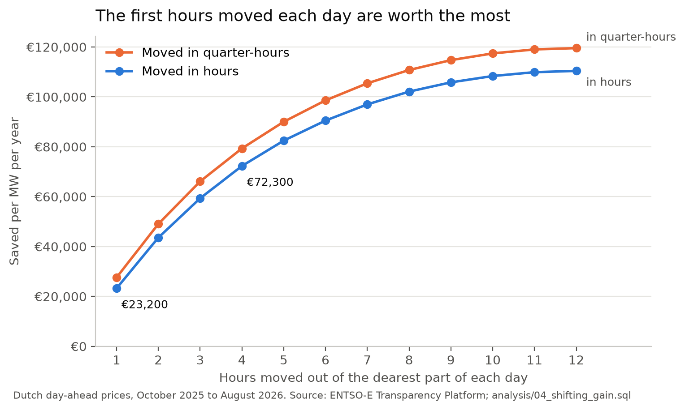

# Cutting electricity costs by choosing when to consume

| Read | To |
|---|---|
| [`BRIEF.md`](BRIEF.md) | see what was asked, and what this data can and cannot answer |
| [`REPORT.md`](REPORT.md) | get the answer: what we found, and what we recommend a flexible consumer does |
| [`DATA.md`](DATA.md) | judge whether to believe the numbers: every source, unit and decision behind them |

Dutch electricity prices go negative at midday more often every full year and go extreme on weekday evenings. We took five and a half years of Dutch day-ahead prices, load, the electricity used across the whole country, and generation from the ENTSO-E Transparency Platform, 2021 to August 2026, and asked what a business able to move part of its consumption to cheaper hours would gain, and when.



## What we found

- **Negative prices rose in every full year, from 0.80% of hours in 2021 to 6.76% in 2025**, concentrated at midday in spring and summer, and **extreme hours**, those averaging above €225 per MWh, are an evening event that, outside the 2021-22 gas crisis, has been rare.
- **Extreme days, those with at least one extreme hour, are disproportionately the days of highest load and of widest gas-and-coal swing**: 250 of 364 were among their month's days of highest load, against 233 that chance would give, and chance alone produces an overlap that large about once in 32,000 tries.
- **Moving 1 MW of consumption out of each day's most expensive hour is worth about €23,200 a year**, and €72,300 for four hours a day. Each further hour is worth less than the one before.
- **Acting in quarter-hours, possible since the day-ahead market moved to 15-minute prices in October 2025, adds 19%** at one hour a day. Measured hour by hour, the gap between a day's dearest and ordinary price has not grown since 2023: the growth is the finer grain.

The recommendation, the evidence and the caveats are in [`REPORT.md`](REPORT.md).

## How it is built

- **A hand-written client for the ENTSO-E API**: authentication from the environment, requests windowed on Amsterdam local days so a clock change cannot shift a boundary, and retries with backoff for the failures a retry can cure. The whole range arrives in 21 requests.
- **A parser for ENTSO-E's XML**, including its **sparse block encoding**, in which a listed value holds until the next one, and the two directions a generation series can carry.
- **A star schema in DuckDB**, the measurements kept in **fact tables** and joined by keys to the **dimension tables** that describe them, so each description is stored once: three fact tables at the resolution the data was published at, an hourly time dimension that handles the 23 and 25-hour days, a production type dimension, and the derived tables the analysis reads.
- **Validation inside the load**: 21 invariants checked in the same transaction as the load, so a database that breaks one is never committed. Each invariant has a test that corrupts the data and confirms it fires.
- **The analysis in SQL**, one file per question in `analysis/`, and every figure in `DATA.md` regenerated by a file in `evidence/`.
- **Tests that never touch the network**, run with lint and format checks on every push.

## Running it

You need Python 3.12 or later, the [DuckDB command-line client](https://duckdb.org/docs/installation/) to run the SQL files, and a free ENTSO-E security token.

**Install** in a virtual environment:

```bash
python -m venv .venv
source .venv/bin/activate
pip install -e ".[dev]"
```

**Get a token.** Register an account at [transparency.entsoe.eu](https://transparency.entsoe.eu), email `transparency@entsoe.eu` with the subject `RESTful API access` and your registered address in the body, and once access is granted generate the token under the account settings. The code reads it only from the environment variable `ENTSOE_TOKEN`, and it never belongs in the repository. One way to keep it in a file only your user can read, exported in every new terminal on Linux or WSL:

```bash
mkdir -p ~/.config/entsoe
nano ~/.config/entsoe/token          # paste the token as the file's only content, then save
chmod 600 ~/.config/entsoe/token
echo 'export ENTSOE_TOKEN="$(< ~/.config/entsoe/token)"' >> ~/.bashrc
source ~/.bashrc
```

`echo "${#ENTSOE_TOKEN}"` should print `36`, confirming the token is set without showing it. The token is part of every request URL, so do not share logs or screenshots that show a full one.

**Fetch** the three datasets into `data/raw/`, 21 files and about 400 MB. A file already fetched is skipped, so an interrupted run can simply be started again:

```bash
python -m gridstress.fetch
```

**Load** them into `data/processed/grid.duckdb`, building and validating ten tables in one transaction:

```bash
python -m gridstress.load
```

**Run an analysis**, one file per question, read-only:

```bash
duckdb -readonly data/processed/grid.duckdb -c ".read analysis/04_shifting_gain.sql"
```

The same command runs any file in `analysis/` or `evidence/`. Each file's header says what it answers and how many rows each statement should return.

**Test**, with no token and no network:

```bash
pytest
```

The notebooks in `notebooks/` need the plotting extra. `nbstripout --install` makes git strip their outputs on every commit:

```bash
pip install -e ".[figures]"
nbstripout --install
```

## Licence

MIT, see [`LICENSE`](LICENSE).
